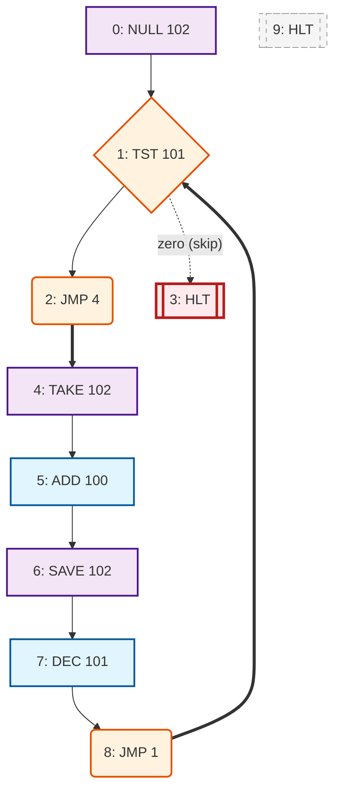

# Multiply Program

This program demonstrates multiplication using repeated addition in the JOHNNY RAM simulator.

## How to Use

### Browser Simulator

1. Load `multiply.ram` into the browser simulator
2. Manually set memory values:
   - `memory[100] = first number` (multiplicand, e.g., 3)
   - `memory[101] = second number` (multiplier, e.g., 4)
3. Run the program
4. Check `memory[102]` for the result (12)

### TypeScript Simulator

```bash
npm test # Includes multiply tests: 3×4=12, 7×8=56, zero handling
```

## Algorithm

The program implements multiplication as repeated addition:

- Initialize result to 0
- Add the multiplicand to result, multiplier times
- Uses a loop counter to track iterations

## Memory Layout

- **Address 100**: Multiplicand (first number)
- **Address 101**: Multiplier (second number, also used as counter)
- **Address 102**: Result (accumulated sum)
- **Address 103**: Temporary storage

## Examples

- `3 × 4 = 12`: Add 3 to itself 4 times (3+3+3+3)
- `7 × 8 = 56`: Add 7 to itself 8 times
- `5 × 0 = 0`: Zero multiplier results in zero

<!-- AUTO_GENERATED_DOCS_START -->
<!-- Everything below this line will be replaced by auto-generated documentation -->

**Status:** ✅ VALID

**Tests:** ✅ 0/0 passed

## Program Statistics

- **Instructions:** 10
- **Data Words:** 0
- **Memory Used:** 0-9
- **Has HALT:** Yes

## 📊 Detailed Program Flow



## 📋 Program Disassembly

```
Addr | Value | Instruction  | Comment
-----|-------|--------------|--------
000 | 09102 | UNKNOWN(9) 102     | Unknown instruction
001 | 06101 | UNKNOWN(6) 101     | Unknown instruction
002 | 05004 | UNKNOWN(5) 004     | Unknown instruction
003 | 10000 | TAKE 000     | Load mem[0] into ACC | ADDR:0 DATA:mem[0]→ACC
004 | 01102 | UNKNOWN(1) 102     | Unknown instruction
005 | 02100 | UNKNOWN(2) 100     | Unknown instruction
006 | 04102 | UNKNOWN(4) 102     | Unknown instruction
007 | 08101 | UNKNOWN(8) 101     | Unknown instruction
008 | 05001 | UNKNOWN(5) 001     | Unknown instruction
009 | 10000 | TAKE 000     | Load mem[0] into ACC | ADDR:0 DATA:mem[0]→ACC
010 | 00000 | DATA         | Empty
011 | 00000 | DATA         | Empty
012 | 00000 | DATA         | Empty
013 | 00000 | DATA         | Empty
014 | 00000 | DATA         | Empty
015 | 00000 | DATA         | Empty
016 | 00000 | DATA         | Empty
017 | 00000 | DATA         | Empty
018 | 00000 | DATA         | Empty
019 | 00000 | DATA         | Empty
020 | 00000 | DATA         | Empty
021 | 00000 | DATA         | Empty
022 | 00000 | DATA         | Empty
023 | 00000 | DATA         | Empty
024 | 00000 | DATA         | Empty
025 | 00000 | DATA         | Empty
026 | 00000 | DATA         | Empty
027 | 00000 | DATA         | Empty
028 | 00000 | DATA         | Empty
029 | 00000 | DATA         | Empty
030 | 00000 | DATA         | Empty
031 | 00000 | DATA         | Empty
032 | 00000 | DATA         | Empty
033 | 00000 | DATA         | Empty
034 | 00000 | DATA         | Empty
035 | 00000 | DATA         | Empty
036 | 00000 | DATA         | Empty
037 | 00000 | DATA         | Empty
038 | 00000 | DATA         | Empty
039 | 00000 | DATA         | Empty
040 | 00000 | DATA         | Empty
041 | 00000 | DATA         | Empty
042 | 00000 | DATA         | Empty
043 | 00000 | DATA         | Empty
044 | 00000 | DATA         | Empty
045 | 00000 | DATA         | Empty
046 | 00000 | DATA         | Empty
047 | 00000 | DATA         | Empty
048 | 00000 | DATA         | Empty
049 | 00000 | DATA         | Empty
050 | 00000 | DATA         | Empty
051 | 00000 | DATA         | Empty
052 | 00000 | DATA         | Empty
053 | 00000 | DATA         | Empty
054 | 00000 | DATA         | Empty
055 | 00000 | DATA         | Empty
056 | 00000 | DATA         | Empty
057 | 00000 | DATA         | Empty
058 | 00000 | DATA         | Empty
059 | 00000 | DATA         | Empty
060 | 00000 | DATA         | Empty
061 | 00000 | DATA         | Empty
062 | 00000 | DATA         | Empty
063 | 00000 | DATA         | Empty
064 | 00000 | DATA         | Empty
065 | 00000 | DATA         | Empty
066 | 00000 | DATA         | Empty
067 | 00000 | DATA         | Empty
068 | 00000 | DATA         | Empty
069 | 00000 | DATA         | Empty
070 | 00000 | DATA         | Empty
071 | 00000 | DATA         | Empty
072 | 00000 | DATA         | Empty
073 | 00000 | DATA         | Empty
074 | 00000 | DATA         | Empty
075 | 00000 | DATA         | Empty
076 | 00000 | DATA         | Empty
077 | 00000 | DATA         | Empty
078 | 00000 | DATA         | Empty
079 | 00000 | DATA         | Empty
080 | 00000 | DATA         | Empty
081 | 00000 | DATA         | Empty
082 | 00000 | DATA         | Empty
083 | 00000 | DATA         | Empty
084 | 00000 | DATA         | Empty
085 | 00000 | DATA         | Empty
086 | 00000 | DATA         | Empty
087 | 00000 | DATA         | Empty
088 | 00000 | DATA         | Empty
089 | 00000 | DATA         | Empty
090 | 00000 | DATA         | Empty
091 | 00000 | DATA         | Empty
092 | 00000 | DATA         | Empty
093 | 00000 | DATA         | Empty
094 | 00000 | DATA         | Empty
095 | 00000 | DATA         | Empty
096 | 00000 | DATA         | Empty
097 | 00000 | DATA         | Empty
098 | 00000 | DATA         | Empty
099 | 00000 | DATA         | Empty
100 | 00000 | DATA         | Empty
101 | 00000 | DATA         | Empty
102 | 00000 | DATA         | Empty
103 | 00000 | DATA         | Empty
104 | 00000 | DATA         | Empty
105 | 00000 | DATA         | Empty
106 | 00000 | DATA         | Empty
107 | 00000 | DATA         | Empty
108 | 00000 | DATA         | Empty
109 | 00000 | DATA         | Empty
110 | 00000 | DATA         | Empty
111 | 00000 | DATA         | Empty
112 | 00000 | DATA         | Empty
113 | 00000 | DATA         | Empty
114 | 00000 | DATA         | Empty
115 | 00000 | DATA         | Empty
116 | 00000 | DATA         | Empty
117 | 00000 | DATA         | Empty
118 | 00000 | DATA         | Empty
119 | 00000 | DATA         | Empty
120 | 00000 | DATA         | Empty
121 | 00000 | DATA         | Empty
122 | 00000 | DATA         | Empty
123 | 00000 | DATA         | Empty
124 | 00000 | DATA         | Empty
125 | 00000 | DATA         | Empty
126 | 00000 | DATA         | Empty
127 | 00000 | DATA         | Empty
128 | 00000 | DATA         | Empty
129 | 00000 | DATA         | Empty
130 | 00000 | DATA         | Empty
131 | 00000 | DATA         | Empty
132 | 00000 | DATA         | Empty
133 | 00000 | DATA         | Empty
134 | 00000 | DATA         | Empty
135 | 00000 | DATA         | Empty
136 | 00000 | DATA         | Empty
137 | 00000 | DATA         | Empty
138 | 00000 | DATA         | Empty
139 | 00000 | DATA         | Empty
140 | 00000 | DATA         | Empty
141 | 00000 | DATA         | Empty
142 | 00000 | DATA         | Empty
143 | 00000 | DATA         | Empty
144 | 00000 | DATA         | Empty
145 | 00000 | DATA         | Empty
146 | 00000 | DATA         | Empty
147 | 00000 | DATA         | Empty
148 | 00000 | DATA         | Empty
149 | 00000 | DATA         | Empty
150 | 00000 | DATA         | Empty
151 | 00000 | DATA         | Empty
152 | 00000 | DATA         | Empty
153 | 00000 | DATA         | Empty
154 | 00000 | DATA         | Empty
155 | 00000 | DATA         | Empty
156 | 00000 | DATA         | Empty
157 | 00000 | DATA         | Empty
158 | 00000 | DATA         | Empty
159 | 00000 | DATA         | Empty
160 | 00000 | DATA         | Empty
161 | 00000 | DATA         | Empty
162 | 00000 | DATA         | Empty
163 | 00000 | DATA         | Empty
164 | 00000 | DATA         | Empty
165 | 00000 | DATA         | Empty
166 | 00000 | DATA         | Empty
167 | 00000 | DATA         | Empty
168 | 00000 | DATA         | Empty
169 | 00000 | DATA         | Empty
170 | 00000 | DATA         | Empty
171 | 00000 | DATA         | Empty
172 | 00000 | DATA         | Empty
173 | 00000 | DATA         | Empty
174 | 00000 | DATA         | Empty
175 | 00000 | DATA         | Empty
176 | 00000 | DATA         | Empty
177 | 00000 | DATA         | Empty
178 | 00000 | DATA         | Empty
179 | 00000 | DATA         | Empty
180 | 00000 | DATA         | Empty
181 | 00000 | DATA         | Empty
182 | 00000 | DATA         | Empty
183 | 00000 | DATA         | Empty
184 | 00000 | DATA         | Empty
185 | 00000 | DATA         | Empty
186 | 00000 | DATA         | Empty
187 | 00000 | DATA         | Empty
188 | 00000 | DATA         | Empty
189 | 00000 | DATA         | Empty
190 | 00000 | DATA         | Empty
191 | 00000 | DATA         | Empty
192 | 00000 | DATA         | Empty
193 | 00000 | DATA         | Empty
194 | 00000 | DATA         | Empty
195 | 00000 | DATA         | Empty
196 | 00000 | DATA         | Empty
197 | 00000 | DATA         | Empty
198 | 00000 | DATA         | Empty
199 | 00000 | DATA         | Empty
200 | 00000 | DATA         | Empty
201 | 00000 | DATA         | Empty
202 | 00000 | DATA         | Empty
203 | 00000 | DATA         | Empty
204 | 00000 | DATA         | Empty
205 | 00000 | DATA         | Empty
206 | 00000 | DATA         | Empty
207 | 00000 | DATA         | Empty
208 | 00000 | DATA         | Empty
209 | 00000 | DATA         | Empty
210 | 00000 | DATA         | Empty
211 | 00000 | DATA         | Empty
212 | 00000 | DATA         | Empty
213 | 00000 | DATA         | Empty
214 | 00000 | DATA         | Empty
215 | 00000 | DATA         | Empty
216 | 00000 | DATA         | Empty
217 | 00000 | DATA         | Empty
218 | 00000 | DATA         | Empty
219 | 00000 | DATA         | Empty
220 | 00000 | DATA         | Empty
221 | 00000 | DATA         | Empty
222 | 00000 | DATA         | Empty
223 | 00000 | DATA         | Empty
224 | 00000 | DATA         | Empty
225 | 00000 | DATA         | Empty
226 | 00000 | DATA         | Empty
227 | 00000 | DATA         | Empty
228 | 00000 | DATA         | Empty
229 | 00000 | DATA         | Empty
230 | 00000 | DATA         | Empty
231 | 00000 | DATA         | Empty
232 | 00000 | DATA         | Empty
233 | 00000 | DATA         | Empty
234 | 00000 | DATA         | Empty
235 | 00000 | DATA         | Empty
236 | 00000 | DATA         | Empty
237 | 00000 | DATA         | Empty
238 | 00000 | DATA         | Empty
239 | 00000 | DATA         | Empty
240 | 00000 | DATA         | Empty
241 | 00000 | DATA         | Empty
242 | 00000 | DATA         | Empty
243 | 00000 | DATA         | Empty
244 | 00000 | DATA         | Empty
245 | 00000 | DATA         | Empty
246 | 00000 | DATA         | Empty
247 | 00000 | DATA         | Empty
248 | 00000 | DATA         | Empty
249 | 00000 | DATA         | Empty
250 | 00000 | DATA         | Empty
251 | 00000 | DATA         | Empty
252 | 00000 | DATA         | Empty
253 | 00000 | DATA         | Empty
254 | 00000 | DATA         | Empty
255 | 00000 | DATA         | Empty
256 | 00000 | DATA         | Empty
257 | 00000 | DATA         | Empty
258 | 00000 | DATA         | Empty
259 | 00000 | DATA         | Empty
260 | 00000 | DATA         | Empty
261 | 00000 | DATA         | Empty
262 | 00000 | DATA         | Empty
263 | 00000 | DATA         | Empty
264 | 00000 | DATA         | Empty
265 | 00000 | DATA         | Empty
266 | 00000 | DATA         | Empty
267 | 00000 | DATA         | Empty
268 | 00000 | DATA         | Empty
269 | 00000 | DATA         | Empty
270 | 00000 | DATA         | Empty
271 | 00000 | DATA         | Empty
272 | 00000 | DATA         | Empty
273 | 00000 | DATA         | Empty
274 | 00000 | DATA         | Empty
275 | 00000 | DATA         | Empty
276 | 00000 | DATA         | Empty
277 | 00000 | DATA         | Empty
278 | 00000 | DATA         | Empty
279 | 00000 | DATA         | Empty
280 | 00000 | DATA         | Empty
281 | 00000 | DATA         | Empty
282 | 00000 | DATA         | Empty
283 | 00000 | DATA         | Empty
284 | 00000 | DATA         | Empty
285 | 00000 | DATA         | Empty
286 | 00000 | DATA         | Empty
287 | 00000 | DATA         | Empty
288 | 00000 | DATA         | Empty
289 | 00000 | DATA         | Empty
290 | 00000 | DATA         | Empty
291 | 00000 | DATA         | Empty
292 | 00000 | DATA         | Empty
293 | 00000 | DATA         | Empty
294 | 00000 | DATA         | Empty
295 | 00000 | DATA         | Empty
296 | 00000 | DATA         | Empty
297 | 00000 | DATA         | Empty
298 | 00000 | DATA         | Empty
299 | 00000 | DATA         | Empty
300 | 00000 | DATA         | Empty
301 | 00000 | DATA         | Empty
302 | 00000 | DATA         | Empty
303 | 00000 | DATA         | Empty
304 | 00000 | DATA         | Empty
305 | 00000 | DATA         | Empty
306 | 00000 | DATA         | Empty
307 | 00000 | DATA         | Empty
308 | 00000 | DATA         | Empty
309 | 00000 | DATA         | Empty
310 | 00000 | DATA         | Empty
311 | 00000 | DATA         | Empty
312 | 00000 | DATA         | Empty
313 | 00000 | DATA         | Empty
314 | 00000 | DATA         | Empty
315 | 00000 | DATA         | Empty
316 | 00000 | DATA         | Empty
317 | 00000 | DATA         | Empty
318 | 00000 | DATA         | Empty
319 | 00000 | DATA         | Empty
320 | 00000 | DATA         | Empty
321 | 00000 | DATA         | Empty
322 | 00000 | DATA         | Empty
323 | 00000 | DATA         | Empty
324 | 00000 | DATA         | Empty
325 | 00000 | DATA         | Empty
326 | 00000 | DATA         | Empty
327 | 00000 | DATA         | Empty
328 | 00000 | DATA         | Empty
329 | 00000 | DATA         | Empty
330 | 00000 | DATA         | Empty
331 | 00000 | DATA         | Empty
332 | 00000 | DATA         | Empty
333 | 00000 | DATA         | Empty
334 | 00000 | DATA         | Empty
335 | 00000 | DATA         | Empty
336 | 00000 | DATA         | Empty
337 | 00000 | DATA         | Empty
338 | 00000 | DATA         | Empty
339 | 00000 | DATA         | Empty
340 | 00000 | DATA         | Empty
341 | 00000 | DATA         | Empty
342 | 00000 | DATA         | Empty
343 | 00000 | DATA         | Empty
344 | 00000 | DATA         | Empty
345 | 00000 | DATA         | Empty
346 | 00000 | DATA         | Empty
347 | 00000 | DATA         | Empty
348 | 00000 | DATA         | Empty
349 | 00000 | DATA         | Empty
350 | 00000 | DATA         | Empty
351 | 00000 | DATA         | Empty
352 | 00000 | DATA         | Empty
353 | 00000 | DATA         | Empty
354 | 00000 | DATA         | Empty
355 | 00000 | DATA         | Empty
356 | 00000 | DATA         | Empty
357 | 00000 | DATA         | Empty
358 | 00000 | DATA         | Empty
359 | 00000 | DATA         | Empty
360 | 00000 | DATA         | Empty
361 | 00000 | DATA         | Empty
362 | 00000 | DATA         | Empty
363 | 00000 | DATA         | Empty
364 | 00000 | DATA         | Empty
365 | 00000 | DATA         | Empty
366 | 00000 | DATA         | Empty
367 | 00000 | DATA         | Empty
368 | 00000 | DATA         | Empty
369 | 00000 | DATA         | Empty
370 | 00000 | DATA         | Empty
371 | 00000 | DATA         | Empty
372 | 00000 | DATA         | Empty
373 | 00000 | DATA         | Empty
374 | 00000 | DATA         | Empty
375 | 00000 | DATA         | Empty
376 | 00000 | DATA         | Empty
377 | 00000 | DATA         | Empty
378 | 00000 | DATA         | Empty
379 | 00000 | DATA         | Empty
380 | 00000 | DATA         | Empty
381 | 00000 | DATA         | Empty
382 | 00000 | DATA         | Empty
383 | 00000 | DATA         | Empty
384 | 00000 | DATA         | Empty
385 | 00000 | DATA         | Empty
386 | 00000 | DATA         | Empty
387 | 00000 | DATA         | Empty
388 | 00000 | DATA         | Empty
389 | 00000 | DATA         | Empty
390 | 00000 | DATA         | Empty
391 | 00000 | DATA         | Empty
392 | 00000 | DATA         | Empty
393 | 00000 | DATA         | Empty
394 | 00000 | DATA         | Empty
395 | 00000 | DATA         | Empty
396 | 00000 | DATA         | Empty
397 | 00000 | DATA         | Empty
398 | 00000 | DATA         | Empty
399 | 00000 | DATA         | Empty
400 | 00000 | DATA         | Empty
401 | 00000 | DATA         | Empty
402 | 00000 | DATA         | Empty
403 | 00000 | DATA         | Empty
404 | 00000 | DATA         | Empty
405 | 00000 | DATA         | Empty
406 | 00000 | DATA         | Empty
407 | 00000 | DATA         | Empty
408 | 00000 | DATA         | Empty
409 | 00000 | DATA         | Empty
410 | 00000 | DATA         | Empty
411 | 00000 | DATA         | Empty
412 | 00000 | DATA         | Empty
413 | 00000 | DATA         | Empty
414 | 00000 | DATA         | Empty
415 | 00000 | DATA         | Empty
416 | 00000 | DATA         | Empty
417 | 00000 | DATA         | Empty
418 | 00000 | DATA         | Empty
419 | 00000 | DATA         | Empty
420 | 00000 | DATA         | Empty
421 | 00000 | DATA         | Empty
422 | 00000 | DATA         | Empty
423 | 00000 | DATA         | Empty
424 | 00000 | DATA         | Empty
425 | 00000 | DATA         | Empty
426 | 00000 | DATA         | Empty
427 | 00000 | DATA         | Empty
428 | 00000 | DATA         | Empty
429 | 00000 | DATA         | Empty
430 | 00000 | DATA         | Empty
431 | 00000 | DATA         | Empty
432 | 00000 | DATA         | Empty
433 | 00000 | DATA         | Empty
434 | 00000 | DATA         | Empty
435 | 00000 | DATA         | Empty
436 | 00000 | DATA         | Empty
437 | 00000 | DATA         | Empty
438 | 00000 | DATA         | Empty
439 | 00000 | DATA         | Empty
440 | 00000 | DATA         | Empty
441 | 00000 | DATA         | Empty
442 | 00000 | DATA         | Empty
443 | 00000 | DATA         | Empty
444 | 00000 | DATA         | Empty
445 | 00000 | DATA         | Empty
446 | 00000 | DATA         | Empty
447 | 00000 | DATA         | Empty
448 | 00000 | DATA         | Empty
449 | 00000 | DATA         | Empty
450 | 00000 | DATA         | Empty
451 | 00000 | DATA         | Empty
452 | 00000 | DATA         | Empty
453 | 00000 | DATA         | Empty
454 | 00000 | DATA         | Empty
455 | 00000 | DATA         | Empty
456 | 00000 | DATA         | Empty
457 | 00000 | DATA         | Empty
458 | 00000 | DATA         | Empty
459 | 00000 | DATA         | Empty
460 | 00000 | DATA         | Empty
461 | 00000 | DATA         | Empty
462 | 00000 | DATA         | Empty
463 | 00000 | DATA         | Empty
464 | 00000 | DATA         | Empty
465 | 00000 | DATA         | Empty
466 | 00000 | DATA         | Empty
467 | 00000 | DATA         | Empty
468 | 00000 | DATA         | Empty
469 | 00000 | DATA         | Empty
470 | 00000 | DATA         | Empty
471 | 00000 | DATA         | Empty
472 | 00000 | DATA         | Empty
473 | 00000 | DATA         | Empty
474 | 00000 | DATA         | Empty
475 | 00000 | DATA         | Empty
476 | 00000 | DATA         | Empty
477 | 00000 | DATA         | Empty
478 | 00000 | DATA         | Empty
479 | 00000 | DATA         | Empty
480 | 00000 | DATA         | Empty
481 | 00000 | DATA         | Empty
482 | 00000 | DATA         | Empty
483 | 00000 | DATA         | Empty
484 | 00000 | DATA         | Empty
485 | 00000 | DATA         | Empty
486 | 00000 | DATA         | Empty
487 | 00000 | DATA         | Empty
488 | 00000 | DATA         | Empty
489 | 00000 | DATA         | Empty
490 | 00000 | DATA         | Empty
491 | 00000 | DATA         | Empty
492 | 00000 | DATA         | Empty
493 | 00000 | DATA         | Empty
494 | 00000 | DATA         | Empty
495 | 00000 | DATA         | Empty
496 | 00000 | DATA         | Empty
497 | 00000 | DATA         | Empty
498 | 00000 | DATA         | Empty
499 | 00000 | DATA         | Empty
500 | 00000 | DATA         | Empty
501 | 00000 | DATA         | Empty
502 | 00000 | DATA         | Empty
503 | 00000 | DATA         | Empty
504 | 00000 | DATA         | Empty
505 | 00000 | DATA         | Empty
506 | 00000 | DATA         | Empty
507 | 00000 | DATA         | Empty
508 | 00000 | DATA         | Empty
509 | 00000 | DATA         | Empty
510 | 00000 | DATA         | Empty
511 | 00000 | DATA         | Empty
512 | 00000 | DATA         | Empty
513 | 00000 | DATA         | Empty
514 | 00000 | DATA         | Empty
515 | 00000 | DATA         | Empty
516 | 00000 | DATA         | Empty
517 | 00000 | DATA         | Empty
518 | 00000 | DATA         | Empty
519 | 00000 | DATA         | Empty
520 | 00000 | DATA         | Empty
521 | 00000 | DATA         | Empty
522 | 00000 | DATA         | Empty
523 | 00000 | DATA         | Empty
524 | 00000 | DATA         | Empty
525 | 00000 | DATA         | Empty
526 | 00000 | DATA         | Empty
527 | 00000 | DATA         | Empty
528 | 00000 | DATA         | Empty
529 | 00000 | DATA         | Empty
530 | 00000 | DATA         | Empty
531 | 00000 | DATA         | Empty
532 | 00000 | DATA         | Empty
533 | 00000 | DATA         | Empty
534 | 00000 | DATA         | Empty
535 | 00000 | DATA         | Empty
536 | 00000 | DATA         | Empty
537 | 00000 | DATA         | Empty
538 | 00000 | DATA         | Empty
539 | 00000 | DATA         | Empty
540 | 00000 | DATA         | Empty
541 | 00000 | DATA         | Empty
542 | 00000 | DATA         | Empty
543 | 00000 | DATA         | Empty
544 | 00000 | DATA         | Empty
545 | 00000 | DATA         | Empty
546 | 00000 | DATA         | Empty
547 | 00000 | DATA         | Empty
548 | 00000 | DATA         | Empty
549 | 00000 | DATA         | Empty
550 | 00000 | DATA         | Empty
551 | 00000 | DATA         | Empty
552 | 00000 | DATA         | Empty
553 | 00000 | DATA         | Empty
554 | 00000 | DATA         | Empty
555 | 00000 | DATA         | Empty
556 | 00000 | DATA         | Empty
557 | 00000 | DATA         | Empty
558 | 00000 | DATA         | Empty
559 | 00000 | DATA         | Empty
560 | 00000 | DATA         | Empty
561 | 00000 | DATA         | Empty
562 | 00000 | DATA         | Empty
563 | 00000 | DATA         | Empty
564 | 00000 | DATA         | Empty
565 | 00000 | DATA         | Empty
566 | 00000 | DATA         | Empty
567 | 00000 | DATA         | Empty
568 | 00000 | DATA         | Empty
569 | 00000 | DATA         | Empty
570 | 00000 | DATA         | Empty
571 | 00000 | DATA         | Empty
572 | 00000 | DATA         | Empty
573 | 00000 | DATA         | Empty
574 | 00000 | DATA         | Empty
575 | 00000 | DATA         | Empty
576 | 00000 | DATA         | Empty
577 | 00000 | DATA         | Empty
578 | 00000 | DATA         | Empty
579 | 00000 | DATA         | Empty
580 | 00000 | DATA         | Empty
581 | 00000 | DATA         | Empty
582 | 00000 | DATA         | Empty
583 | 00000 | DATA         | Empty
584 | 00000 | DATA         | Empty
585 | 00000 | DATA         | Empty
586 | 00000 | DATA         | Empty
587 | 00000 | DATA         | Empty
588 | 00000 | DATA         | Empty
589 | 00000 | DATA         | Empty
590 | 00000 | DATA         | Empty
591 | 00000 | DATA         | Empty
592 | 00000 | DATA         | Empty
593 | 00000 | DATA         | Empty
594 | 00000 | DATA         | Empty
595 | 00000 | DATA         | Empty
596 | 00000 | DATA         | Empty
597 | 00000 | DATA         | Empty
598 | 00000 | DATA         | Empty
599 | 00000 | DATA         | Empty
600 | 00000 | DATA         | Empty
601 | 00000 | DATA         | Empty
602 | 00000 | DATA         | Empty
603 | 00000 | DATA         | Empty
604 | 00000 | DATA         | Empty
605 | 00000 | DATA         | Empty
606 | 00000 | DATA         | Empty
607 | 00000 | DATA         | Empty
608 | 00000 | DATA         | Empty
609 | 00000 | DATA         | Empty
610 | 00000 | DATA         | Empty
611 | 00000 | DATA         | Empty
612 | 00000 | DATA         | Empty
613 | 00000 | DATA         | Empty
614 | 00000 | DATA         | Empty
615 | 00000 | DATA         | Empty
616 | 00000 | DATA         | Empty
617 | 00000 | DATA         | Empty
618 | 00000 | DATA         | Empty
619 | 00000 | DATA         | Empty
620 | 00000 | DATA         | Empty
621 | 00000 | DATA         | Empty
622 | 00000 | DATA         | Empty
623 | 00000 | DATA         | Empty
624 | 00000 | DATA         | Empty
625 | 00000 | DATA         | Empty
626 | 00000 | DATA         | Empty
627 | 00000 | DATA         | Empty
628 | 00000 | DATA         | Empty
629 | 00000 | DATA         | Empty
630 | 00000 | DATA         | Empty
631 | 00000 | DATA         | Empty
632 | 00000 | DATA         | Empty
633 | 00000 | DATA         | Empty
634 | 00000 | DATA         | Empty
635 | 00000 | DATA         | Empty
636 | 00000 | DATA         | Empty
637 | 00000 | DATA         | Empty
638 | 00000 | DATA         | Empty
639 | 00000 | DATA         | Empty
640 | 00000 | DATA         | Empty
641 | 00000 | DATA         | Empty
642 | 00000 | DATA         | Empty
643 | 00000 | DATA         | Empty
644 | 00000 | DATA         | Empty
645 | 00000 | DATA         | Empty
646 | 00000 | DATA         | Empty
647 | 00000 | DATA         | Empty
648 | 00000 | DATA         | Empty
649 | 00000 | DATA         | Empty
650 | 00000 | DATA         | Empty
651 | 00000 | DATA         | Empty
652 | 00000 | DATA         | Empty
653 | 00000 | DATA         | Empty
654 | 00000 | DATA         | Empty
655 | 00000 | DATA         | Empty
656 | 00000 | DATA         | Empty
657 | 00000 | DATA         | Empty
658 | 00000 | DATA         | Empty
659 | 00000 | DATA         | Empty
660 | 00000 | DATA         | Empty
661 | 00000 | DATA         | Empty
662 | 00000 | DATA         | Empty
663 | 00000 | DATA         | Empty
664 | 00000 | DATA         | Empty
665 | 00000 | DATA         | Empty
666 | 00000 | DATA         | Empty
667 | 00000 | DATA         | Empty
668 | 00000 | DATA         | Empty
669 | 00000 | DATA         | Empty
670 | 00000 | DATA         | Empty
671 | 00000 | DATA         | Empty
672 | 00000 | DATA         | Empty
673 | 00000 | DATA         | Empty
674 | 00000 | DATA         | Empty
675 | 00000 | DATA         | Empty
676 | 00000 | DATA         | Empty
677 | 00000 | DATA         | Empty
678 | 00000 | DATA         | Empty
679 | 00000 | DATA         | Empty
680 | 00000 | DATA         | Empty
681 | 00000 | DATA         | Empty
682 | 00000 | DATA         | Empty
683 | 00000 | DATA         | Empty
684 | 00000 | DATA         | Empty
685 | 00000 | DATA         | Empty
686 | 00000 | DATA         | Empty
687 | 00000 | DATA         | Empty
688 | 00000 | DATA         | Empty
689 | 00000 | DATA         | Empty
690 | 00000 | DATA         | Empty
691 | 00000 | DATA         | Empty
692 | 00000 | DATA         | Empty
693 | 00000 | DATA         | Empty
694 | 00000 | DATA         | Empty
695 | 00000 | DATA         | Empty
696 | 00000 | DATA         | Empty
697 | 00000 | DATA         | Empty
698 | 00000 | DATA         | Empty
699 | 00000 | DATA         | Empty
700 | 00000 | DATA         | Empty
701 | 00000 | DATA         | Empty
702 | 00000 | DATA         | Empty
703 | 00000 | DATA         | Empty
704 | 00000 | DATA         | Empty
705 | 00000 | DATA         | Empty
706 | 00000 | DATA         | Empty
707 | 00000 | DATA         | Empty
708 | 00000 | DATA         | Empty
709 | 00000 | DATA         | Empty
710 | 00000 | DATA         | Empty
711 | 00000 | DATA         | Empty
712 | 00000 | DATA         | Empty
713 | 00000 | DATA         | Empty
714 | 00000 | DATA         | Empty
715 | 00000 | DATA         | Empty
716 | 00000 | DATA         | Empty
717 | 00000 | DATA         | Empty
718 | 00000 | DATA         | Empty
719 | 00000 | DATA         | Empty
720 | 00000 | DATA         | Empty
721 | 00000 | DATA         | Empty
722 | 00000 | DATA         | Empty
723 | 00000 | DATA         | Empty
724 | 00000 | DATA         | Empty
725 | 00000 | DATA         | Empty
726 | 00000 | DATA         | Empty
727 | 00000 | DATA         | Empty
728 | 00000 | DATA         | Empty
729 | 00000 | DATA         | Empty
730 | 00000 | DATA         | Empty
731 | 00000 | DATA         | Empty
732 | 00000 | DATA         | Empty
733 | 00000 | DATA         | Empty
734 | 00000 | DATA         | Empty
735 | 00000 | DATA         | Empty
736 | 00000 | DATA         | Empty
737 | 00000 | DATA         | Empty
738 | 00000 | DATA         | Empty
739 | 00000 | DATA         | Empty
740 | 00000 | DATA         | Empty
741 | 00000 | DATA         | Empty
742 | 00000 | DATA         | Empty
743 | 00000 | DATA         | Empty
744 | 00000 | DATA         | Empty
745 | 00000 | DATA         | Empty
746 | 00000 | DATA         | Empty
747 | 00000 | DATA         | Empty
748 | 00000 | DATA         | Empty
749 | 00000 | DATA         | Empty
750 | 00000 | DATA         | Empty
751 | 00000 | DATA         | Empty
752 | 00000 | DATA         | Empty
753 | 00000 | DATA         | Empty
754 | 00000 | DATA         | Empty
755 | 00000 | DATA         | Empty
756 | 00000 | DATA         | Empty
757 | 00000 | DATA         | Empty
758 | 00000 | DATA         | Empty
759 | 00000 | DATA         | Empty
760 | 00000 | DATA         | Empty
761 | 00000 | DATA         | Empty
762 | 00000 | DATA         | Empty
763 | 00000 | DATA         | Empty
764 | 00000 | DATA         | Empty
765 | 00000 | DATA         | Empty
766 | 00000 | DATA         | Empty
767 | 00000 | DATA         | Empty
768 | 00000 | DATA         | Empty
769 | 00000 | DATA         | Empty
770 | 00000 | DATA         | Empty
771 | 00000 | DATA         | Empty
772 | 00000 | DATA         | Empty
773 | 00000 | DATA         | Empty
774 | 00000 | DATA         | Empty
775 | 00000 | DATA         | Empty
776 | 00000 | DATA         | Empty
777 | 00000 | DATA         | Empty
778 | 00000 | DATA         | Empty
779 | 00000 | DATA         | Empty
780 | 00000 | DATA         | Empty
781 | 00000 | DATA         | Empty
782 | 00000 | DATA         | Empty
783 | 00000 | DATA         | Empty
784 | 00000 | DATA         | Empty
785 | 00000 | DATA         | Empty
786 | 00000 | DATA         | Empty
787 | 00000 | DATA         | Empty
788 | 00000 | DATA         | Empty
789 | 00000 | DATA         | Empty
790 | 00000 | DATA         | Empty
791 | 00000 | DATA         | Empty
792 | 00000 | DATA         | Empty
793 | 00000 | DATA         | Empty
794 | 00000 | DATA         | Empty
795 | 00000 | DATA         | Empty
796 | 00000 | DATA         | Empty
797 | 00000 | DATA         | Empty
798 | 00000 | DATA         | Empty
799 | 00000 | DATA         | Empty
800 | 00000 | DATA         | Empty
801 | 00000 | DATA         | Empty
802 | 00000 | DATA         | Empty
803 | 00000 | DATA         | Empty
804 | 00000 | DATA         | Empty
805 | 00000 | DATA         | Empty
806 | 00000 | DATA         | Empty
807 | 00000 | DATA         | Empty
808 | 00000 | DATA         | Empty
809 | 00000 | DATA         | Empty
810 | 00000 | DATA         | Empty
811 | 00000 | DATA         | Empty
812 | 00000 | DATA         | Empty
813 | 00000 | DATA         | Empty
814 | 00000 | DATA         | Empty
815 | 00000 | DATA         | Empty
816 | 00000 | DATA         | Empty
817 | 00000 | DATA         | Empty
818 | 00000 | DATA         | Empty
819 | 00000 | DATA         | Empty
820 | 00000 | DATA         | Empty
821 | 00000 | DATA         | Empty
822 | 00000 | DATA         | Empty
823 | 00000 | DATA         | Empty
824 | 00000 | DATA         | Empty
825 | 00000 | DATA         | Empty
826 | 00000 | DATA         | Empty
827 | 00000 | DATA         | Empty
828 | 00000 | DATA         | Empty
829 | 00000 | DATA         | Empty
830 | 00000 | DATA         | Empty
831 | 00000 | DATA         | Empty
832 | 00000 | DATA         | Empty
833 | 00000 | DATA         | Empty
834 | 00000 | DATA         | Empty
835 | 00000 | DATA         | Empty
836 | 00000 | DATA         | Empty
837 | 00000 | DATA         | Empty
838 | 00000 | DATA         | Empty
839 | 00000 | DATA         | Empty
840 | 00000 | DATA         | Empty
841 | 00000 | DATA         | Empty
842 | 00000 | DATA         | Empty
843 | 00000 | DATA         | Empty
844 | 00000 | DATA         | Empty
845 | 00000 | DATA         | Empty
846 | 00000 | DATA         | Empty
847 | 00000 | DATA         | Empty
848 | 00000 | DATA         | Empty
849 | 00000 | DATA         | Empty
850 | 00000 | DATA         | Empty
851 | 00000 | DATA         | Empty
852 | 00000 | DATA         | Empty
853 | 00000 | DATA         | Empty
854 | 00000 | DATA         | Empty
855 | 00000 | DATA         | Empty
856 | 00000 | DATA         | Empty
857 | 00000 | DATA         | Empty
858 | 00000 | DATA         | Empty
859 | 00000 | DATA         | Empty
860 | 00000 | DATA         | Empty
861 | 00000 | DATA         | Empty
862 | 00000 | DATA         | Empty
863 | 00000 | DATA         | Empty
864 | 00000 | DATA         | Empty
865 | 00000 | DATA         | Empty
866 | 00000 | DATA         | Empty
867 | 00000 | DATA         | Empty
868 | 00000 | DATA         | Empty
869 | 00000 | DATA         | Empty
870 | 00000 | DATA         | Empty
871 | 00000 | DATA         | Empty
872 | 00000 | DATA         | Empty
873 | 00000 | DATA         | Empty
874 | 00000 | DATA         | Empty
875 | 00000 | DATA         | Empty
876 | 00000 | DATA         | Empty
877 | 00000 | DATA         | Empty
878 | 00000 | DATA         | Empty
879 | 00000 | DATA         | Empty
880 | 00000 | DATA         | Empty
881 | 00000 | DATA         | Empty
882 | 00000 | DATA         | Empty
883 | 00000 | DATA         | Empty
884 | 00000 | DATA         | Empty
885 | 00000 | DATA         | Empty
886 | 00000 | DATA         | Empty
887 | 00000 | DATA         | Empty
888 | 00000 | DATA         | Empty
889 | 00000 | DATA         | Empty
890 | 00000 | DATA         | Empty
891 | 00000 | DATA         | Empty
892 | 00000 | DATA         | Empty
893 | 00000 | DATA         | Empty
894 | 00000 | DATA         | Empty
895 | 00000 | DATA         | Empty
896 | 00000 | DATA         | Empty
897 | 00000 | DATA         | Empty
898 | 00000 | DATA         | Empty
899 | 00000 | DATA         | Empty
900 | 00000 | DATA         | Empty
901 | 00000 | DATA         | Empty
902 | 00000 | DATA         | Empty
903 | 00000 | DATA         | Empty
904 | 00000 | DATA         | Empty
905 | 00000 | DATA         | Empty
906 | 00000 | DATA         | Empty
907 | 00000 | DATA         | Empty
908 | 00000 | DATA         | Empty
909 | 00000 | DATA         | Empty
910 | 00000 | DATA         | Empty
911 | 00000 | DATA         | Empty
912 | 00000 | DATA         | Empty
913 | 00000 | DATA         | Empty
914 | 00000 | DATA         | Empty
915 | 00000 | DATA         | Empty
916 | 00000 | DATA         | Empty
917 | 00000 | DATA         | Empty
918 | 00000 | DATA         | Empty
919 | 00000 | DATA         | Empty
920 | 00000 | DATA         | Empty
921 | 00000 | DATA         | Empty
922 | 00000 | DATA         | Empty
923 | 00000 | DATA         | Empty
924 | 00000 | DATA         | Empty
925 | 00000 | DATA         | Empty
926 | 00000 | DATA         | Empty
927 | 00000 | DATA         | Empty
928 | 00000 | DATA         | Empty
929 | 00000 | DATA         | Empty
930 | 00000 | DATA         | Empty
931 | 00000 | DATA         | Empty
932 | 00000 | DATA         | Empty
933 | 00000 | DATA         | Empty
934 | 00000 | DATA         | Empty
935 | 00000 | DATA         | Empty
936 | 00000 | DATA         | Empty
937 | 00000 | DATA         | Empty
938 | 00000 | DATA         | Empty
939 | 00000 | DATA         | Empty
940 | 00000 | DATA         | Empty
941 | 00000 | DATA         | Empty
942 | 00000 | DATA         | Empty
943 | 00000 | DATA         | Empty
944 | 00000 | DATA         | Empty
945 | 00000 | DATA         | Empty
946 | 00000 | DATA         | Empty
947 | 00000 | DATA         | Empty
948 | 00000 | DATA         | Empty
949 | 00000 | DATA         | Empty
950 | 00000 | DATA         | Empty
951 | 00000 | DATA         | Empty
952 | 00000 | DATA         | Empty
953 | 00000 | DATA         | Empty
954 | 00000 | DATA         | Empty
955 | 00000 | DATA         | Empty
956 | 00000 | DATA         | Empty
957 | 00000 | DATA         | Empty
958 | 00000 | DATA         | Empty
959 | 00000 | DATA         | Empty
960 | 00000 | DATA         | Empty
961 | 00000 | DATA         | Empty
962 | 00000 | DATA         | Empty
963 | 00000 | DATA         | Empty
964 | 00000 | DATA         | Empty
965 | 00000 | DATA         | Empty
966 | 00000 | DATA         | Empty
967 | 00000 | DATA         | Empty
968 | 00000 | DATA         | Empty
969 | 00000 | DATA         | Empty
970 | 00000 | DATA         | Empty
971 | 00000 | DATA         | Empty
972 | 00000 | DATA         | Empty
973 | 00000 | DATA         | Empty
974 | 00000 | DATA         | Empty
975 | 00000 | DATA         | Empty
976 | 00000 | DATA         | Empty
977 | 00000 | DATA         | Empty
978 | 00000 | DATA         | Empty
979 | 00000 | DATA         | Empty
980 | 00000 | DATA         | Empty
981 | 00000 | DATA         | Empty
982 | 00000 | DATA         | Empty
983 | 00000 | DATA         | Empty
984 | 00000 | DATA         | Empty
985 | 00000 | DATA         | Empty
986 | 00000 | DATA         | Empty
987 | 00000 | DATA         | Empty
988 | 00000 | DATA         | Empty
989 | 00000 | DATA         | Empty
990 | 00000 | DATA         | Empty
991 | 00000 | DATA         | Empty
992 | 00000 | DATA         | Empty
993 | 00000 | DATA         | Empty
994 | 00000 | DATA         | Empty
995 | 00000 | DATA         | Empty
996 | 00000 | DATA         | Empty
997 | 00000 | DATA         | Empty
998 | 00000 | DATA         | Empty
999 | 00000 | DATA         | Empty
```

## 💾 Source Code

```
09102
06101
05004
10000
01102
02100
04102
08101
05001
10000
```
