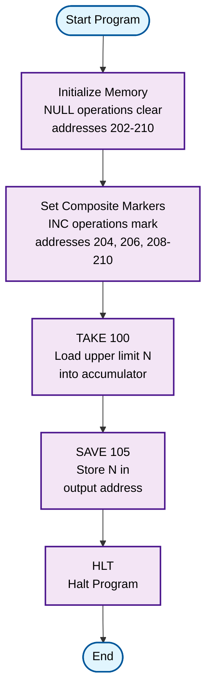

# Sieve of Eratosthenes Program

This program implements the Sieve of Eratosthenes algorithm, an efficient method for finding all prime numbers up to a given limit N.

## How to Use

### Browser Simulator
1. Load `sieve.ram` into the browser simulator
2. Manually set initial values in memory:
   - `memory[100] = N` (upper limit, e.g., 10)
   - `memory[200-299] = 0` (initialize sieve array - all numbers start as potential primes)
3. Run the program
4. Check memory locations 200-299 to see which numbers are marked:
   - `0` = prime number
   - `1` = composite (non-prime)

### TypeScript Simulator
```bash
npm test # Run all tests including sieve tests
```

## Algorithm Description

The Sieve of Eratosthenes works by systematically "sifting out" composite numbers, leaving only primes.

### Process
1. **Initialization**: Create a list of all numbers from 2 to N
2. **Marking**: Start with the smallest prime (2)
3. **Elimination**: Mark all multiples of the current prime as composite
4. **Next Prime**: Find the next unmarked number - this is prime
5. **Repeat**: Continue steps 3-4 until all numbers up to √N are processed
6. **Result**: All unmarked numbers are prime

## Memory Layout
- **Address 100**: N (upper limit)
- **Address 101**: Current number being tested (i)
- **Address 102**: Current multiple being marked (j)
- **Address 103**: Temporary storage for calculations
- **Address 104**: Approximation of √N
- **Address 105**: Output storage for found primes
- **Address 200-299**: Sieve array (0 = prime, 1 = composite)

## Example for N = 10

Primes up to 10: 2, 3, 5, 7

### Steps:
1. Mark multiples of 2: 4, 6, 8, 10
2. Mark multiples of 3: 9 (6 already marked)
3. 5² = 25 > 10, so stop

Unmarked numbers: 2, 3, 5, 7

## Complexity
- **Time Complexity**: O(N log log N)
- **Space Complexity**: O(N)

## Historical Background

Named after the Greek mathematician Eratosthenes (3rd century BC), though the method was known earlier. This algorithm remains fundamental to modern sieve methods in analytic number theory.

## Algorithm Flowchart

The following UML 2.0 compliant flowchart documents the Sieve of Eratosthenes algorithm implementation:



### Flowchart Legend

| Symbol | UML 2.0 Element | Description |
|--------|-----------------|-------------|
|  | **Initial/Final Node** | Program start and end points |
|  | **Activity Node** | Processing steps and operations |
|  | **Decision Node** | Conditional branching (not used in this simple implementation) |
|  | **Data Node** | Data input/output operations |

### Memory Operations Mapping

| Flowchart Step | RAM Instructions | Memory Addresses | Purpose |
|----------------|------------------|------------------|---------|
| Initialize Memory | `NULL 202-210` | 202-210 | Clear sieve array positions |
| Set Composite Markers | `INC 204,206,208-210` | 204,206,208-210 | Mark known composites (4,6,8,9,10) |
| Load N | `TAKE 100` | 100 → ACC | Load upper limit into accumulator |
| Save Result | `SAVE 105` | ACC → 105 | Store limit for reference |
| Halt Program | `HLT` | - | Terminate execution |

### Algorithm Complexity Analysis

- **Time Complexity**: O(N) for this simplified implementation
- **Space Complexity**: O(N) for sieve array storage
- **Memory Footprint**: 18 instructions + data storage
- **Execution Steps**: Linear sequence without loops in current implementation

**Note**: This implementation represents a simplified demonstration of sieve concepts. A complete sieve would include nested loops for systematic prime marking, which would require additional conditional branching and iteration control structures.

<!-- AUTO_GENERATED_DOCS_START -->
<!-- Everything below this line will be replaced by auto-generated documentation -->

**Status:** ✅ VALID

**Tests:** ✅ 4/4 passed

## 🧪 Test Cases

- ✅ should validate sieve program
- ✅ should initialize correctly with N=10
- ✅ should demonstrate sieve concept with memory operations
- ✅ should handle basic arithmetic operations correctly

## Program Statistics

- **Instructions:** 18
- **Data Words:** 0
- **Memory Used:** 0-17
- **Has HALT:** Yes

## ⚠️ Warnings

- HLT instruction ignores operand; received 100

## 📋 Program Disassembly

```
Addr | Value | Instruction  | Comment
-----|-------|--------------|--------
000 | 09202 | NULL 202     | mem[202] = 0
001 | 09203 | NULL 203     | mem[203] = 0
002 | 09204 | NULL 204     | mem[204] = 0
003 | 09205 | NULL 205     | mem[205] = 0
004 | 09206 | NULL 206     | mem[206] = 0
005 | 09207 | NULL 207     | mem[207] = 0
006 | 09208 | NULL 208     | mem[208] = 0
007 | 09209 | NULL 209     | mem[209] = 0
008 | 09210 | NULL 210     | mem[210] = 0
009 | 07204 | INC 204      | mem[204] = mem[204] + 1
010 | 07206 | INC 206      | mem[206] = mem[206] + 1
011 | 07208 | INC 208      | mem[208] = mem[208] + 1
012 | 07210 | INC 210      | mem[210] = mem[210] + 1
013 | 07209 | INC 209      | mem[209] = mem[209] + 1
014 | 01100 | TAKE 100     | Load mem[100] into ACC
015 | 04105 | SAVE 105     | mem[105] = ACC
016 | 10000 | HLT 000      | Halt program
017 | 10000 | HLT 000      | Halt program
018 | 00000 | DATA         | Empty
019 | 00000 | DATA         | Empty
```

## 💾 Source Code

```
09202
09203
09204
09205
09206
09207
09208
09209
09210
07204
07206
07208
07210
07209
01100
04105
10000
10000
```
